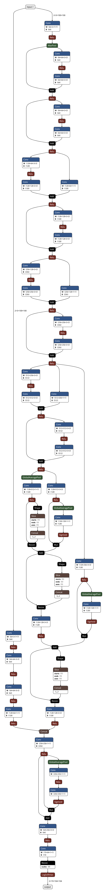

# Generate .onnx files to see model architecture

- main file : model/bisenet/cityscapes.bisenet.R18/networ.py

- added missing param C.epoch_num = 1 in model/bisenet/cityscapes.bisenet.R18/config.py

### create model and save it as onnx

```
# in __main__ of network.py 

## load model
model = BiSeNet(19, None, None)

## Input to the model

imgs = torch.randn(batch_size, 1, 100, 100, requires_grad=True)

# forward
res = model(imgs)
torch.onnx.export(model, 
                imgs, 
                os.path.join(os.path.dirname(__file__), "model0.onnx"),  
                export_params=True,        # store the trained parameter weights inside the model file


```

# visualization

